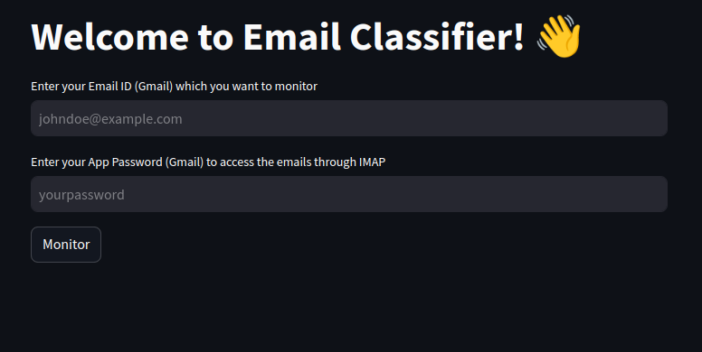
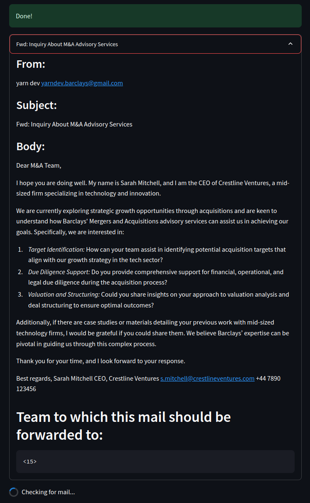
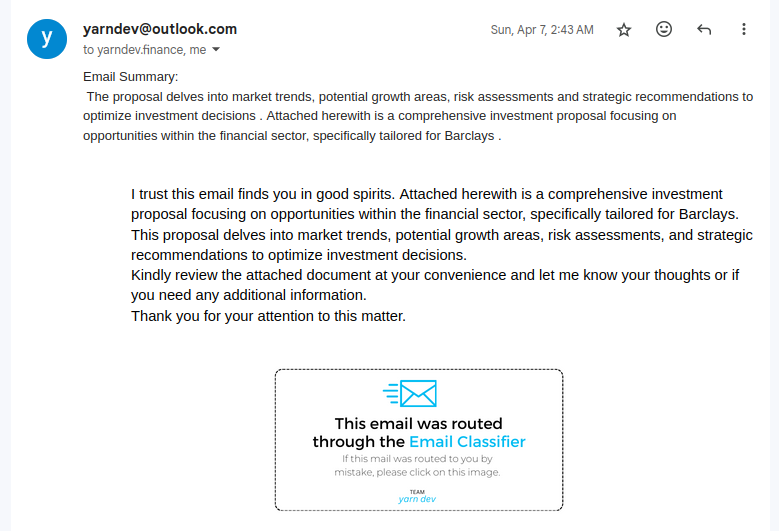

<div align="center">
    

[](LICENSE)
[](https://www.python.org/downloads/)

</div>

> This project was the **winner** at **Barclays Pune** and bagged the **3rd Prize** 🏆 overall at [Barclays Hack-O-Hire 2024](https://www.hackerearth.com/challenges/hackathon/hack-o-hire/). 
> We also had the amazing opportunity of presenting our solution in front of the Global Leadership of Barclays International in August 2024.

Receiving hundreds or thousands of mails a day and then figuring out which mail should be directed to which person can be a daunting task. This project aims to tackle that problem. We created a solution that can effectively classify emails based on not only their content, but also the context in which they are written, and then route them to the respective department(s) or person(s) in charge.

# Problem Statement

Multiple emails from customers/clients that are dealt with different teams based on the context. This solution should enable auto-classification of emails based on the context, so the same can be routed to best suited team for further processing.

**Technology**:

-   Python
-   Anaconda platform

**Other Considerations**:

The data selected should represent sufficient variation to be able to demonstrate classification clearly. Expectation from participants will be to present overall solution with clear focus on characteristics of data and holistic nature of the implementation.

**Dataset**:

For solving this problem, participants can decide to leverage data available on public forums like Kaggle (preferably from finance domain). But the model should be easy to configure/retrain for similar topics.

**Design Considerations**:

This model should be easy to deploy to execute either as batch or real time.
Focus should also be on making it efficient from resource consumption standpoint and something that can be hosted as containers.

**Benefits**:

Auto-email classification will enable significant reduction in manual efforts

# Solution


> [!NOTE]
> The solution mentioned below is what we had implemented for the hackathon in April 2024. Since then, running LLMs on-device has become much easier thanks to Ollama, hence
> we have updated the project to Ollama instead of using a cloud-hosted model.

> [Demo Video](https://www.youtube.com/watch?v=2kT37tIz6ME)

<div align="center">
    
    <br />

_Process Flow Diagram_

</div>

### Working

Our solution works as follows:

1. **Email Receiving**: We have a root node, which acts as the central email receiver in an organization. It is continuously monitored for new emails through the IMAP protocol (which is done in a continuously running python service). It can be any professional email service like Gmail, Outlook, etc.
2. **Distributed Task Queue**: Each email is then sent to a distributed task queue, where it is processed by multiple parallel workers, thus ensuring that the system is scalable and can handle a large number of emails. The system can thus **scale horizontally** very effectively.
3. **Parsing**: The email is parsed and the content is extracted (including attachments!)
4. **Encryption**: The content is encrypted using a powerful cypher.
5. **Sending to Server**: The encrypted content is sent to the server where it is decrypted.
6. **Large Language Model**: The content is passed to our powerful Large Language Model, Mixtal 8x7b which extracts the meaning, context and the sentiment from the email and determines the department/team to which the email should be routed to, including any CCs or BCCs that it deems important.
7. **Summarization**: The email is then summarized by a lighter model, and the summary is sent back to the service.
8. **Message Composition**: The service then composes a new email with the summary (for quick reference) and the sentiment (e.g. Urgent, Complaint, Neutral) and the original email (along with attachments), and sends it back to the root node.
9. **Routing**: The full email is then routed to the respective department/team/person through the SMTP Protocol.
10. **Feedback System**: The system also has a feedback system, where in the case of incorrect routing, the user can provide feedback, which is then used to retrain the model.

# Tech Stack


[](https://www.python.org)

[](https://ollama.com/)

[](https://docs.celeryq.dev/en/stable/)

[](https://www.rabbitmq.com/)


[](https://huggingface.co/Qwen)

[](https://llama.com)


# Getting Started

Clone or download the repository and follow the steps below to get started.

## Prerequisites

This project requires a message broker installed on the system. We recommend using [RabbitMQ](https://www.rabbitmq.com/).

If you’re using Ubuntu or Debian install RabbitMQ by executing this command:

```bash
sudo apt-get install rabbitmq-server
```

This project also uses [Ollama](https://ollama.com/) under the hood to utilize the power of large language models. To install Ollama, run:

```bash
curl -fsSL https://ollama.com/install.sh | sh
```

We are using the Qwen 4b model for the same. You can use any other model as well, just make sure it has enough context window to understand the email content.

Pull Qwen using:

```bash
ollama pull qwen:4b
```

## Installing Dependencies

1. Prefer installing dependencies in a virtual environment. Create a virtual environment by running:

    ```bash
    python3 -m venv .venv
    ```

2. This project uses [Poetry](https://python-poetry.org/) for dependency management. Make poetry use the newly created virtual environment:

    ```bash
    poetry env use python3
    ```

3. To install the dependencies, run the following command:

    ```bash
    poetry install
    ```

4. Then run the demo app to see the RAG pipeline in action.

    ```bash
    streamlit run src/app.py
    ```

5. Head over to http://localhost:8501 to see the app in action.

    

# Working

The service monitors the email inbox and checks every 10 seconds to see if there are any new emails. If there are, it parses them and sends them to the RAG pipeline. The RAG pipeline then classifies the email and outputs the department ID to which the mail should be sent.



Here, the team id `15` corresponds to the ID of the team in the [Heirarchy JSON file](src/data/rag.json):

```json
{
    "name": "Mergers & Acquisitions",
    "id": 15,
    "description": "The Mergers & Acquisitions team is responsible for identifying and facilitating strategic mergers, acquisitions, and divestitures to support Barclays' growth objectives.",
    "is_leaf": true,
    "children": []
},
```

# Extensions

The above demo was a basic working demo. In the hackathon, we had added a bunch more extensions to the project. Some of them are listed below.

## Advanced RAG

The RAG can be made more advanced by detailing the JSON file with more information about the teams. This can include the team members, their roles, email IDs, etc. This can be used to fetch the email ID of the individual / team directly and forward the email to them.

By prompting the model to also provide CC and BCC, we can also include the relevant stakeholders in the email which would have otherwise not been possible using traditional classifier methods.

Checkout the [advanced RAG JSON](src/data/heirarchy.json) for an example of how to extend the RAG JSON file.

```json
    ...
        {
            "name": "HR",
            "description": "Human Resources department responsible for managing employee-related matters.",
            "emails": ["hr@barclays.com"],
            "children": [
                {
                    "name": "Recruitment",
                    "description": "Responsible for hiring new emails.",
                    "emails": ["recruitment@barclays.com"],
                    "children": []
                },
                {
                    "name": "Employee Benefits",
                    "description": "Handles employee benefits and compensation.",
                    "emails": ["benefits@barclays.com"],
                    "children": []
                },
                ...
            ]
        },
    ...
```

## Email Summarization

Using a lighter model like BART or Qwen 4b, we can summarize the email content and attach it at the header of the mail so that the recipient can quickly glance through the email and understand the context without having to read the entire email. This allows the recipient to assign a priority to the email and respond accordingly.

```python
stream = ollama.chat(
        model='qwen:4b',
        messages=[
            {"role": "system", "content": system_prompt},
            {"role": "user", "content": email_content}
        ],
        stream=True
    )
```

The code for summarization is [here](src/lib/summarize.py).

## Distributed Task Queue


During the hackathon, we had used the HuggingFace Transformers library to access the Mixtral 8x7b Model. Because of using a cloud hosted model, it took a while for the model to process the email and return the output.

It took roughly **15 seconds** from sending a mail to the receiver mail address to the system working and forwarding the mail to the respective team. We tried to batch 10 emails, and it took about 3-5 minutes for the system to process all the emails. Assuming a typical organization receives 10,000 mails in one day, it would take about **150,000 seconds or 41 hours** to process all the emails, which means around 2 days to send just one day's worth of emails. And while one mail was being processed, it would block the main thread from processing other emails.
This would not be acceptable in a real world scenario.

So, we decided to use a distributed task queue to parallelize the processing of emails. This would allow us to process multiple emails at the same time and reduce the time taken to process all the emails. Using Celery, it is possible to process each received mail in parallel so that the system can scale horizontally and process multiple emails at the same time. Using Celery, we tried to batch the same 10 emails again, this time it took only about 15 seconds to process all the emails.

```python
from celery import Celery
celery_app = Celery('tasks', broker='pyamqp://guest@localhost//')

@celery_app.task
def forward_email(email_message: EmailMessage, smtp_server ...)
```

The code for the distributed task queue is [here](src/lib/tasks.py).

## Multilingual Support

The system can be extended to support multiple languages. Using a Google Translate pipeline before sending the output to the model, the system can be made to support multiple languages. This can be done by translating the email content to English before sending it to the model.

```python
from translator import translate_text

query = translate_text(query, 'en')
```

The code for translation is [here](hackathon/ML/app.py).

## Product Watermarking

Since we are using LLMs for forwarding and classifying, they are naturally prone to errors. By adding a picture at the end of the email indicating that the mail has been classified and forwarded using the service, the receipient can be sure that the mail has been forwarded by the system and not manually.



The code for the same is [here](src/lib/forward.py).

## Attachment Content Handling

The system can also handle attachments. The attachments can be parsed and the content can be extracted and sent to the model for classification. The attachments can also be forwarded to the respective team along with the email.

The code for handling attachments is [here](src/lib/attachments.py).

## Mail Forwarding

Combining all the features listed above, we implemented mail forwarding so that as soon as we get the designated email addresses from the output from the LLM, we forward it
to them using SMTP.

```python
forwarded_email = MIMEMultipart()
forwarded_email['From'] = smtp_email
forwarded_email['To'] = forward_to

# Add other parts of the email like header, summary, body text, attachments and watermark.

with smtplib.SMTP(smtp_server, smtp_port) as smtp:
    smtp.starttls()

    # Log into the SMPT server and send the mail
    smtp.login(smtp_email, smtp_password)

    smtp.send_message(
        forwarded_email,

        # The model can also provide CC or BCC mail IDs, so you can add
        # other in CC or BCC as well.
        to_addrs=[forward_to] + (cc_to or []) + (bcc_to or [])
    )
```

The code for the same is [here](src/lib/forward.py).

# Our Team

<div align="center">

</div>

-   [Shantanu Wable](https://github.com/shxntanu)
-   [Piyush Agarwal](https://github.com/piyushhagarwal)
-   [Anish Pawar](https://github.com/anishpawarrr)
-   [Mihir Deshpande](https://github.com/mihirdesh)
